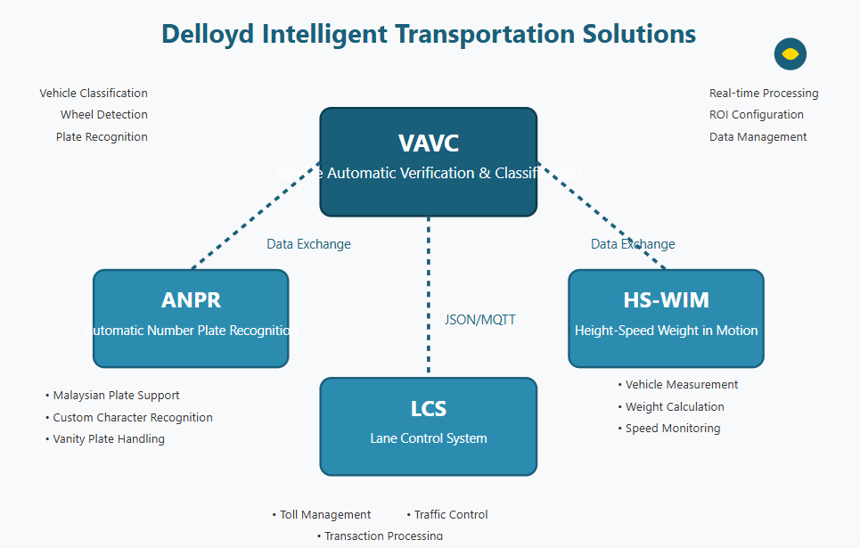
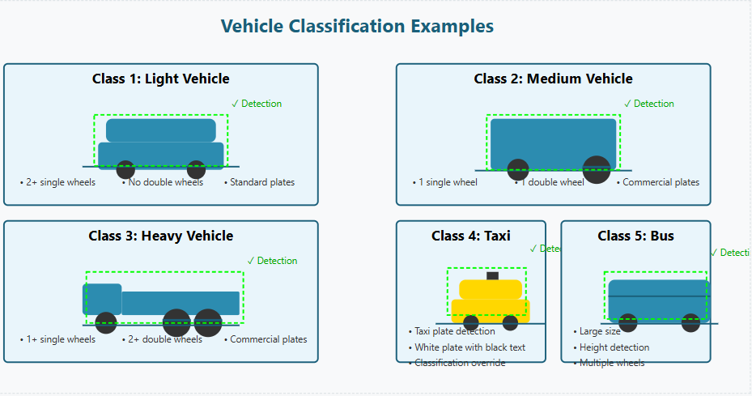

# LDP-GUI2
VAVC System (Vehicle Automatic Verification and Classification) for LDP
# VAVC System (Vehicle Automatic Verification and Classification)


## Overview

The VAVC System is the flagship solution in Delloyd Group's series of intelligent transportation systems. This comprehensive solution provides automatic vehicle detection, classification, and license plate recognition at toll plazas. Using advanced computer vision and machine learning techniques, the VAVC system accurately classifies vehicles into different categories (light vehicles, medium vehicles, heavy vehicles, taxis, and buses) and reads their license plates in real-time.

As part of Delloyd's integrated transportation management ecosystem, the VAVC System offers seamless integration with other Delloyd solutions, providing end-to-end management of toll operations with enhanced accuracy and efficiency.

## Related Delloyd Transportation Solutions

The VAVC System is part of an ecosystem of intelligent transportation solutions developed by Delloyd Group:



1. **ANPR (Automatic Number Plate Recognition)**: Specialized software for reading Malaysian vehicle registration plates, implemented at plaza tolls including Kuala-Lumpur-Karak (KLK) and Lebuhraya Pantai Timur 1 (LPT1).

2. **HS-WIM (Height-Speed Weight in Motion)**: A system that integrates with ANPR to measure vehicle dimensions, speed, and weight for regulatory compliance at locations such as Parit Raja, Johor and Changlung, Kedah.

3. **LCS (Lane Control System)**: Communication system that interfaces with VAVC and ANPR to manage toll lane operations, with standardized data communication formats.

These systems work together to provide a comprehensive transportation management solution that enhances traffic flow, improves compliance monitoring, and increases operational efficiency of toll plazas.

## Key Features

- **Real-time Vehicle Detection**: Identifies vehicles entering the field of view
- **Vehicle Classification**: Automatically categorizes vehicles into 5 classes:
  - Light Vehicles (Class 1)
  - Medium Vehicles (Class 2)
  - Heavy Vehicles (Class 3)
  - Taxis (Class 4)
  - Buses (Class 5)
- **License Plate Recognition**: Detects and reads license plates, with special handling for taxi plates
- **Wheel Detection**: Identifies single and double wheels to improve classification accuracy
- **Configurable ROI**: Allows setting specific regions of interest with visual threshold lines
- **Data Management**: Captures and stores vehicle information with timestamps
- **Integration Capabilities**: Connects via HTTP, MQTT, and FTP for seamless integration with other systems
- **Modern GUI**: User-friendly interface with real-time visualization and system status monitoring



## System Requirements

- Python 3.8+
- PyQt5
- OpenCV
- Ultralytics YOLO
- PyTorch
- CUDA-capable GPU (recommended)
- Webcam or IP camera feed

## Project Structure

```
├── core/
│   ├── data_manager.py         # Handles data storage and retrieval
│   ├── image_processor.py      # Processes images for visualization
│   └── vehicle_detector.py     # Core detection and classification logic
├── handlers/
│   ├── camera_handler.py       # Manages camera input
│   ├── ftp_handler.py          # Handles FTP uploads
│   ├── http_handler.py         # HTTP server for integration
│   ├── mqtt_handler.py         # MQTT communication
│   └── preview_handler.py      # Manages preview window
├── trained_models/             # Directory for model weights
│   ├── cr/                     # Character recognition models
│   ├── lpd/                    # License plate detection models
│   └── vavc/                   # Vehicle classification models
├── utils/                      # Utility scripts
├── gui.py                      # Main GUI implementation
├── main.py                     # Command-line interface
├── plate_recognizer.py         # License plate character recognition
├── config.ini                  # Configuration file
└── README.md                   # This file
```

### Model Directory Structure

The `trained_models` directory contains the neural network weights used by the system:

- **cr**: Character Recognition models for license plate text recognition
- **lpd**: License Plate Detection models for locating license plates on vehicles
- **vavc**: Vehicle Automatic Verification and Classification models for vehicle type classification

These models are essential for the system to function properly and should not be removed or modified manually.

## Installation

1. Clone the repository:
   ```
   git clone https://github.com/your-username/vavc-system.git
   cd vavc-system
   ```

2. Install dependencies:
   ```
   pip install -r requirements.txt
   ```

3. Download trained models and place them in the `trained_models` directory (contact administrator for access).

4. Configure the system by editing `config.ini` or through the GUI.

## Usage

### GUI Mode

Run the system with the graphical user interface:

```
python gui.py
```

This launches the complete dashboard with visual controls and real-time vehicle detection display.

### CLI Mode

Run the system in command-line mode:

```
python main.py
```

This runs the core functionality without the GUI, suitable for headless deployments.

## Configuration

The system can be configured through the GUI or by directly editing the `config.ini` file:

### GUI Configuration

1. Go to the Configuration menu
2. Select from:
   - Host Setup: Configure general settings
   - FTP Configuration: Set up file transfer
   - Source Configuration: Set up camera source
   - ROI Configuration: Set detection regions and thresholds


### Configuration File

The `config.ini` file contains sections for:

- `src_info`: Plaza and lane identification
- `src_input`: Camera inputs and settings
- `roi`: Detection regions and thresholds
- `ftp`: FTP server configuration
- `host_setup`: General system settings

## GUI Components

1. **Main Video Display**: Shows the live camera feed with detection overlays
2. **Vehicle Class Indicators**: Visual representation of the detected vehicle class
3. **Vehicle Counters**: Running count of each vehicle type
4. **Control Panel**: Start/Stop button and system identification
5. **Status Indicators**: Shows connection status for various services
6. **System Logs**: Real-time log display of system events
7. **Captured Vehicle Image**: Last detected vehicle

## Integration Capabilities

### LCS Communication

The VAVC System communicates with the Lane Control System (LCS) using standardized JSON formats via:


1. **HTTP Communication**: VAVC responds to HTTP requests from LCS with vehicle class and image ID information.
   
2. **MQTT Communication**: Real-time messages are sent through MQTT when a vehicle is detected crossing the threshold.

3. **LCS VAVC Request/Response Simulator**: A testing tool is available for simulating LCS communications:
   - StartRecognition: Informs VAVC that LCS is ready to receive MQTT messages
   - StopRecognition: Informs VAVC that LCS is offline
   - RequestVavc: Sends a request to VAVC and waits for vehicle class and image ID response

### Data Standards

The system follows the same data formatting standards as other Delloyd transportation systems, ensuring compatibility across the ecosystem:

1. **Image File Format**: Standardized naming convention including date, time, site ID, lane ID, camera ID, and plate information
2. **Sequence Format**: Structured handling of vehicle and trailer plate numbers
3. **Video File Format**: Consistent naming for video recordings

## How It Works


1. The system captures video frames from a camera source
2. Each frame is processed through a YOLO-based vehicle detector
3. When a vehicle crosses the threshold line, the system:
   - Classifies the vehicle type
   - Detects wheels to confirm classification
   - Recognizes license plates if enabled
   - Saves an image of the vehicle
   - Updates counters and logs
   - Sends data via MQTT and HTTP
   - Uploads images via FTP

## Detection Process

The detection follows these steps:

1. **Frame Capture**: Get frame from camera
2. **ROI Filtering**: Focus on predefined region of interest
3. **YOLO Detection**: Detect vehicle, wheels, and license plates
4. **Position Tracking**: Track vehicle position relative to threshold
5. **Classification**: Determine vehicle type using neural network
6. **Verification**: Confirm classification using wheel detection
7. **Override Logic**: Special handling for taxis with taxi plates
8. **Data Capture**: Save detection data and images

## Model Information

The VAVC system uses YOLOv5-based models for detection and classification, similar to the approach used in Delloyd's ANPR and HS-WIM systems:

| Model Type | Purpose | Features |
|------------|---------|----------|
| Vehicle Detection | Detects vehicles entering the ROI | Identifies vehicle boundaries |
| Vehicle Classification | Categorizes vehicles by type | Differentiates between 5 vehicle classes |
| Wheel Detection | Identifies wheel types | Distinguishes single and double wheels |
| License Plate Detection | Locates license plates on vehicles | Special handling for taxi plates |
| Character Recognition | Reads text from license plates | Handles Malaysian plate formats |

These models work together in a pipeline to provide comprehensive vehicle analysis with high accuracy and low latency.

## License Plate Handling

The VAVC System has specialized handling for Malaysian license plates, including:


### Commercial Vehicle Plates
- Black background with white characters
- Character set includes A-Z (excluding I, O) and 0-9
- Model trained to avoid confusion between similar characters (e.g., 0 vs O, 1 vs I)

### Taxi Plates
- White background with black characters
- New format begins with H followed by alphabetical sequence
- Old format follows commercial vehicle numbering with inverse colors
- Special case: Limousine taxi plates that start with "LIMO"

### Vanity Plates
- Limited quantity plates offered at premium prices by JPJ
- Often uses fancy fonts requiring special post-processing
- System handles common substitutions (1→I, 0→O) for plates like:
  - NBOS, UITM, VIP, PATRIOT, MALAYSIA, PUTRAJAYA, etc.

## File Management

The VAVC system uses a structured file management approach similar to Delloyd's ANPR and HS-WIM systems:

```
├── image/                      # Root directory for saved vehicle images 
│   └── [date-folder]/          # Images organized by date (format: dd-mm-yyyy)
├── log/                        # Directory for log files
│   └── [date-folder]/          # Logs organized by date
└── dataset/                    # Directory for prepared training/testing data if needed
```

### File Naming Convention

The system uses standardized file naming to ensure compatibility with other Delloyd systems:

- **Image Files**: `[YYYYMMDD].[HHMMSS].[fff].[plaza_id].[lane_id].[class_id].jpg`
- **XML Annotation**: `[YYYYMMDD].[HHMMSS].[fff].[plaza_id].[lane_id].[class_id].xml`
- **Log Files**: `[YYYYMMDD].log.csv`

## Advanced Features

### Wheel-Based Verification

The system uses wheel detection to verify and potentially correct vehicle classification:

- **Light Vehicles**: Typically have only single wheels
- **Medium Vehicles**: Have at least one double wheel
- **Heavy Vehicles**: Have at least two double wheels

### Taxi Detection

Special logic is implemented for taxis:

- If a taxi license plate is detected, the vehicle is automatically classified as a taxi
- This overrides the visual classification for greater accuracy

### Duplicate Detection Prevention

The system implements sophisticated duplicate detection:

- Tracks vehicle positions across frames
- Uses temporal and spatial information to prevent multiple counts
- Special handling for closely spaced vehicles

## Troubleshooting

Common issues and solutions:

1. **Camera Connection Fails**:
   - Check IP address/URL in Source Configuration
   - Ensure network connectivity
   - Verify camera credentials if required

2. **No Detections**:
   - Check ROI settings in ROI Configuration
   - Verify model files are in correct locations
   - Check camera positioning and lighting

3. **FTP Upload Errors**:
   - Verify FTP server credentials in FTP Configuration
   - Check network connectivity
   - Ensure upload directory exists and is writable

4. **License Plate Recognition Not Working**:
   - Enable plate recognition in Host Setup
   - Check camera focus and angle
   - Verify character recognition model is present

## Development

For developers looking to extend the system:

- Core detection logic is in `core/vehicle_detector.py`
- GUI implementation is in `gui.py`
- License plate recognition is in `plate_recognizer.py`
- Add new integrations by extending the handlers in `handlers/`

## Credits

Developed by Delloyd Group.

## License

Copyright © 2025 Delloyd Group. All rights reserved.

---
Yousef
